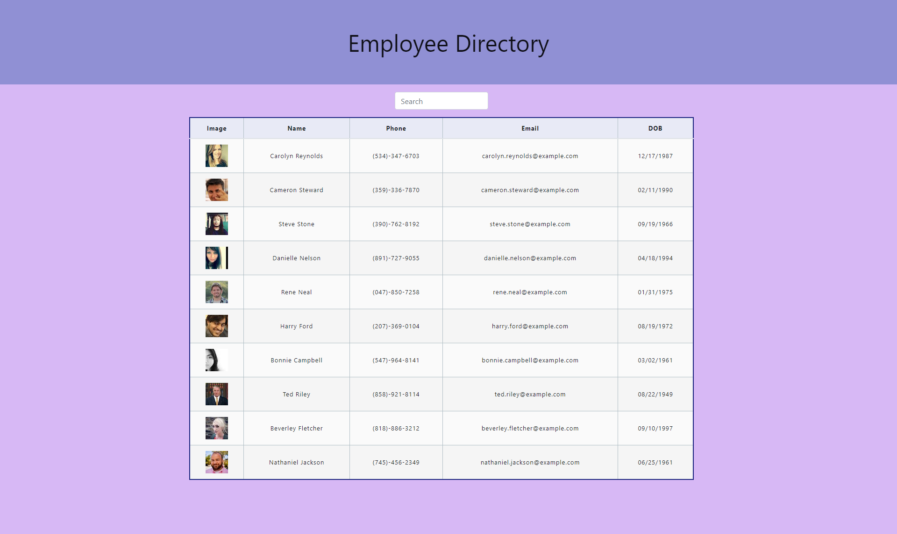

## Employee Directory

#### **Table of Contents**

---

1. [Installalation](#installation)
1. [Trials](#trials)
1. [Usage](#usage)
1. [Credits](#credits)
1. [License](#license)

#### **Installation**

---

To intall this application using prebuilt html and css elements involved this:

1. Install the npm dependencies.
1. Type node server.js.

OR

1. Access the deployed site [here](https://jerler1.github.io/Employee-Directory/)

#### **Trials**

---
This is my first time using react, and I learned a lot.  Building components really helped keep the app from getting majorly cluttered.  

#### **Usage**

---

When you access the deployed website or start the react server.  There are a number of columns (Image, Name, Phone, Email, and DOB) 
and a search input.  If you type anything into the search input it will filter the results that are shown below.  If you click any of the
table headers it will sort that column.  There isn't a sort on the image column.

Link to the deployed website can be found [here](https://jerler1.github.io/Employee-Directory/).

Link to the GitHub repository is [here](https://github.com/jerler1/Employee-Directory).

#### **Credits**

---

Thanks to my classmates Kyle, Tony, and Bradley for the filter debug help.

#### **License**

---

Copyright (c) 2005-2020 David Heinemeier Hansson

Permission is hereby granted, free of charge, to any person obtaining
a copy of this software and associated documentation files (the
"Software"), to deal in the Software without restriction, including
without limitation the rights to use, copy, modify, merge, publish,
distribute, sublicense, and/or sell copies of the Software, and to
permit persons to whom the Software is furnished to do so, subject to
the following conditions:

The above copyright notice and this permission notice shall be
included in all copies or substantial portions of the Software.

THE SOFTWARE IS PROVIDED "AS IS", WITHOUT WARRANTY OF ANY KIND,
EXPRESS OR IMPLIED, INCLUDING BUT NOT LIMITED TO THE WARRANTIES OF
MERCHANTABILITY, FITNESS FOR A PARTICULAR PURPOSE AND
NONINFRINGEMENT. IN NO EVENT SHALL THE AUTHORS OR COPYRIGHT HOLDERS BE
LIABLE FOR ANY CLAIM, DAMAGES OR OTHER LIABILITY, WHETHER IN AN ACTION
OF CONTRACT, TORT OR OTHERWISE, ARISING FROM, OUT OF OR IN CONNECTION
WITH THE SOFTWARE OR THE USE OR OTHER DEALINGS IN THE SOFTWARE.
